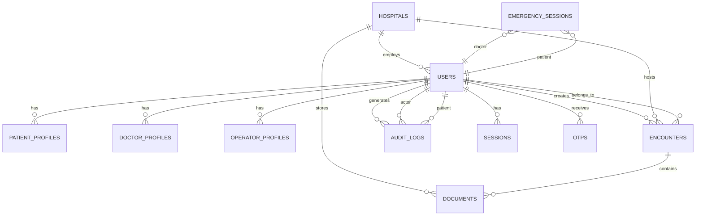
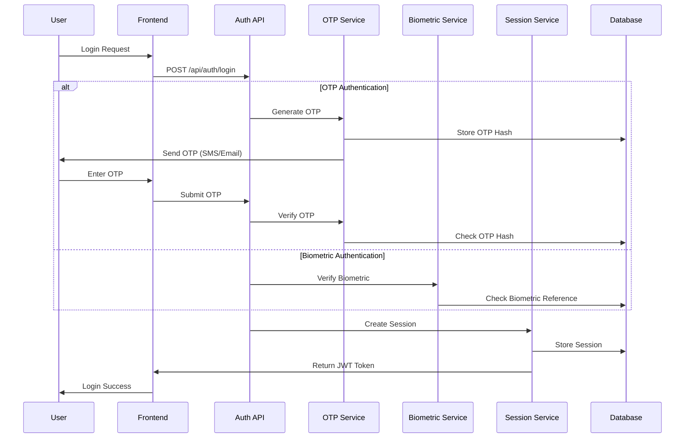
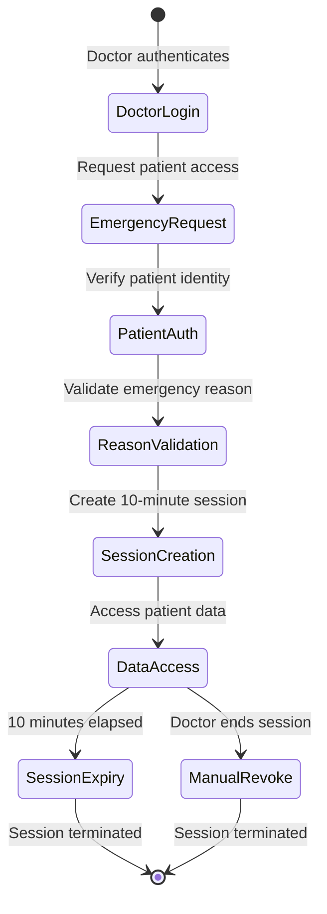
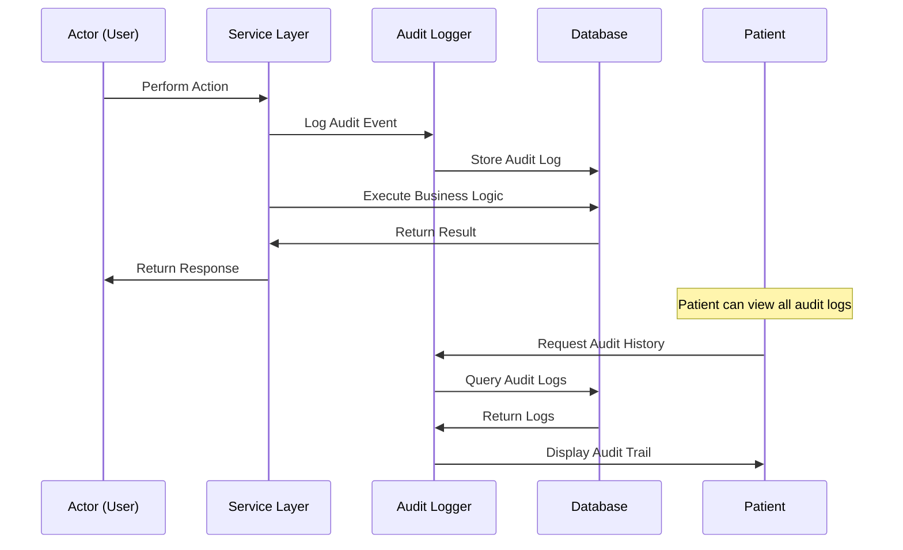
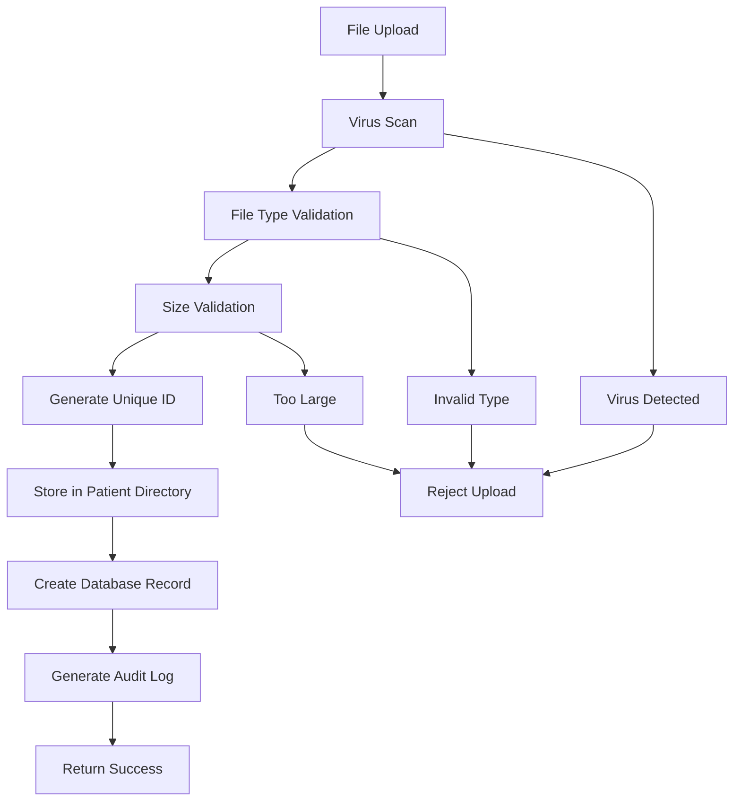
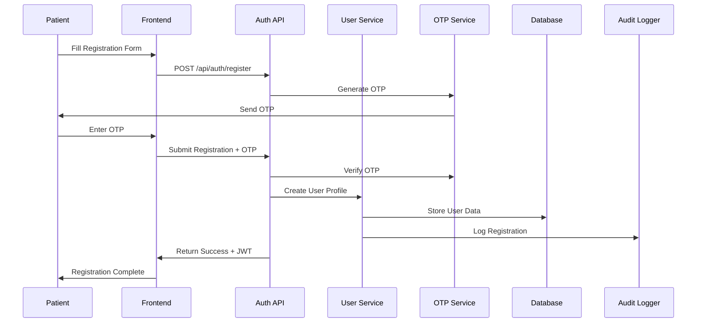
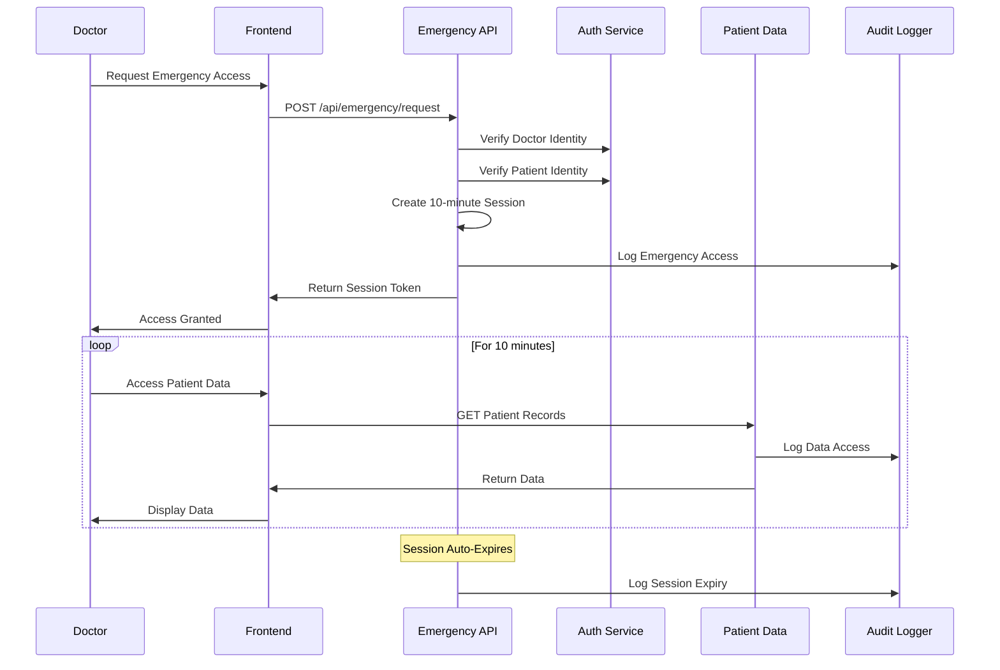
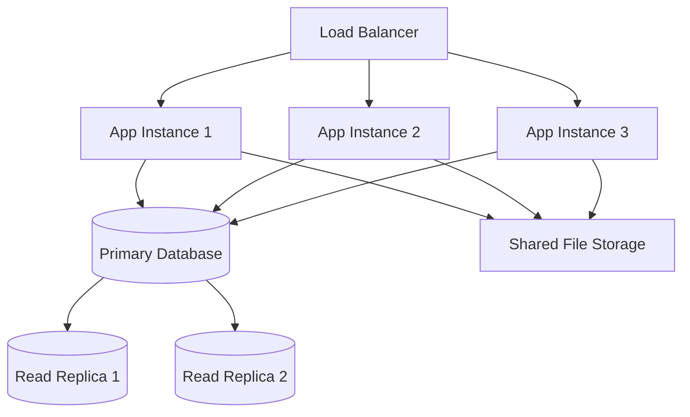

# E-Patient Connect System Architecture

This document provides a comprehensive overview of the E-Patient Connect system architecture, design decisions, and technical implementation.

## 🏗️ System Overview

E-Patient Connect is a patient-owned medical history platform built with a focus on security, transparency, and emergency access capabilities. The system follows a **passwordless authentication model** with comprehensive audit logging.

### Core Principles

- **Patient Ownership**: Patients maintain complete control over their medical data
- **Passwordless Security**: No passwords stored anywhere in the system
- **Emergency Access**: Time-bound (30-minute) emergency access for healthcare providers
- **Complete Transparency**: Comprehensive audit logging of all data access
- **Hospital Boundaries**: Operators restricted to their hospital's data
- **Data Portability**: Patient data accessible across healthcare providers

---

## 🎯 Architecture Patterns

### 1. Monolithic Architecture with Modular Design

```
┌─────────────────────────────────────────────────────────────┐
│                    E-Patient Connect                        │
├─────────────────────────────────────────────────────────────┤
│  Frontend (Next.js App Router)                             │
│  ├── Patient Interface                                     │
│  ├── Doctor Interface                                      │
│  └── Operator Interface                                    │
├─────────────────────────────────────────────────────────────┤
│  API Layer (Next.js API Routes)                           │
│  ├── Authentication APIs                                   │
│  ├── Patient Management APIs                               │
│  ├── Emergency Access APIs                                 │
│  ├── Document Management APIs                              │
│  └── Audit Logging APIs                                    │
├─────────────────────────────────────────────────────────────┤
│  Business Logic Layer                                      │
│  ├── Authentication Services                               │
│  ├── User Management Services                              │
│  ├── Medical Timeline Services                             │
│  ├── Emergency Access Services                             │
│  ├── Document Services                                     │
│  └── Audit Services                                        │
├─────────────────────────────────────────────────────────────┤
│  Data Access Layer                                         │
│  ├── Database Connection Pool                              │
│  ├── Query Builders                                        │
│  └── Transaction Management                                │
├─────────────────────────────────────────────────────────────┤
│  Storage Layer                                             │
│  ├── SQLite Database                                       │
│  └── File System Storage                                   │
└─────────────────────────────────────────────────────────────┘
```

### 2. Domain-Driven Design

The system is organized around core business domains:

- **Authentication Domain**: OTP, biometric, session management
- **User Management Domain**: Patients, doctors, operators
- **Medical Records Domain**: Encounters, timeline, critical info
- **Emergency Access Domain**: Time-bound sessions, access control
- **Document Management Domain**: File upload, storage, retrieval
- **Audit Domain**: Logging, transparency, compliance

---

## 🔧 Technology Stack

### Frontend
- **Framework**: Next.js 14 with App Router
- **Language**: TypeScript
- **Styling**: Tailwind CSS
- **State Management**: React hooks + Context API
- **HTTP Client**: Native fetch API

### Backend
- **Runtime**: Node.js 18+
- **Framework**: Next.js API Routes
- **Language**: TypeScript
- **Authentication**: Custom JWT implementation
- **File Upload**: Multer middleware

### Database
- **Primary Database**: SQLite 3.0+
- **Driver**: Direct SQLite access with connection pooling
- **Schema Management**: Custom SQL scripts
- **Migrations**: Manual SQL execution

### Infrastructure
- **Development**: Local development server
- **Production**: PM2 process manager
- **Web Server**: Nginx (reverse proxy)
- **SSL**: Let's Encrypt certificates
- **Monitoring**: PM2 monitoring + custom health checks

---

## 🗄️ Database Architecture

### Entity Relationship Diagram



### Core Tables

**Users Table**
```sql
CREATE TABLE users (
    id VARCHAR(36) PRIMARY KEY,
    role ENUM('PATIENT', 'DOCTOR', 'OPERATOR') NOT NULL,
    name VARCHAR(255) NOT NULL,
    mobile VARCHAR(20) UNIQUE NOT NULL,
    email VARCHAR(255) UNIQUE NOT NULL,
    hospital_id VARCHAR(36),
    created_at TIMESTAMP DEFAULT CURRENT_TIMESTAMP,
    updated_at TIMESTAMP DEFAULT CURRENT_TIMESTAMP ON UPDATE CURRENT_TIMESTAMP,
    deleted_at TIMESTAMP NULL
);
```

**Patient Profiles Table**
```sql
CREATE TABLE patient_profiles (
    id VARCHAR(36) PRIMARY KEY,
    user_id VARCHAR(36) UNIQUE NOT NULL,
    id_proof_type VARCHAR(50) NOT NULL,
    id_proof_number VARCHAR(100) NOT NULL,
    emergency_contact VARCHAR(20),
    family_member_id VARCHAR(36),
    biometric_fingerprint_ref TEXT,
    biometric_iris_ref TEXT,
    created_at TIMESTAMP DEFAULT CURRENT_TIMESTAMP,
    updated_at TIMESTAMP DEFAULT CURRENT_TIMESTAMP ON UPDATE CURRENT_TIMESTAMP
);
```

**Encounters Table**
```sql
CREATE TABLE encounters (
    id VARCHAR(36) PRIMARY KEY,
    patient_user_id VARCHAR(36) NOT NULL,
    occurred_at TIMESTAMP NOT NULL,
    type VARCHAR(100) NOT NULL,
    reason_diagnosis TEXT,
    prescriptions_notes TEXT,
    allergies_snapshot TEXT,
    chronic_snapshot TEXT,
    blood_group VARCHAR(10),
    recent_surgery TEXT,
    created_by_role ENUM('PATIENT', 'OPERATOR') NOT NULL,
    created_by_user_id VARCHAR(36) NOT NULL,
    hospital_id VARCHAR(36),
    created_at TIMESTAMP DEFAULT CURRENT_TIMESTAMP,
    updated_at TIMESTAMP DEFAULT CURRENT_TIMESTAMP ON UPDATE CURRENT_TIMESTAMP,
    deleted_at TIMESTAMP NULL
);
```

### Indexing Strategy

```sql
-- Performance indexes
CREATE INDEX idx_encounters_patient_date ON encounters(patient_user_id, occurred_at);
CREATE INDEX idx_audit_logs_patient_date ON audit_logs(patient_user_id, created_at);
CREATE INDEX idx_documents_encounter ON documents(encounter_id);
CREATE INDEX idx_sessions_user_expiry ON sessions(user_id, expires_at);
CREATE INDEX idx_otps_user_purpose ON otps(user_id, purpose, expires_at);

-- Security indexes
CREATE INDEX idx_emergency_sessions_doctor ON emergency_sessions(doctor_user_id, expires_at);
CREATE INDEX idx_audit_logs_actor ON audit_logs(actor_user_id, action_type);
```

---

## 🔐 Security Architecture

### Authentication Flow



### Authorization Model

**Role-Based Access Control (RBAC)**

```typescript
interface UserRole {
  PATIENT: {
    canAccess: ['own_profile', 'own_encounters', 'own_audit_logs']
    canCreate: ['encounters', 'profile_updates']
    canUpdate: ['own_profile', 'own_encounters']
    canDelete: ['own_account']
  }
  
  DOCTOR: {
    canAccess: ['emergency_patient_data']
    canCreate: ['emergency_sessions']
    canUpdate: []
    canDelete: []
    timeRestrictions: {
      emergencyAccess: '30_minutes'
    }
  }
  
  OPERATOR: {
    canAccess: ['hospital_patients', 'hospital_encounters']
    canCreate: ['encounters', 'documents']
    canUpdate: ['hospital_encounters']
    canDelete: ['hospital_documents']
    restrictions: {
      hospitalBoundary: true
    }
  }
}
```

### Data Encryption

- **In Transit**: HTTPS/TLS 1.3 encryption
- **At Rest**: Database encryption (MySQL encryption at rest)
- **Sensitive Data**: Biometric references encrypted
- **Tokens**: JWT with HMAC-SHA256 signing

---

## 🚨 Emergency Access System

### Emergency Session Architecture



### Time-Bound Session Management

```typescript
interface EmergencySession {
  sessionId: string
  doctorUserId: string
  patientUserId: string
  reason: string
  createdAt: Date
  expiresAt: Date // Always createdAt + 10 minutes
  isActive: boolean
  accessLog: EmergencyAccessLog[]
}

class EmergencySessionManager {
  private readonly SESSION_DURATION = 30 * 60 * 1000 // 30 minutes
  
  async createSession(request: EmergencyAccessRequest): Promise<EmergencySession> {
    const session = {
      sessionId: generateUUID(),
      doctorUserId: request.doctorUserId,
      patientUserId: request.patientUserId,
      reason: request.reason,
      createdAt: new Date(),
      expiresAt: new Date(Date.now() + this.SESSION_DURATION),
      isActive: true
    }
    
    // Auto-expire session after 30 minutes
    setTimeout(() => this.expireSession(session.sessionId), this.SESSION_DURATION)
    
    return session
  }
}
```

---

## 📊 Audit System Architecture

### Comprehensive Logging Strategy

```typescript
interface AuditLog {
  id: string
  actorUserId: string
  actorRole: UserRole
  patientUserId: string
  actionType: AuditActionType
  resourceType: string
  resourceId: string
  detailsJson: object
  ipAddress: string
  userAgent: string
  createdAt: Date
}

enum AuditActionType {
  // Authentication
  'LOGIN_SUCCESS',
  'LOGIN_FAILED',
  'OTP_GENERATED',
  'BIOMETRIC_AUTH',
  
  // Data Access
  'PATIENT_DATA_ACCESSED',
  'ENCOUNTER_VIEWED',
  'DOCUMENT_DOWNLOADED',
  
  // Emergency Access
  'EMERGENCY_ACCESS_GRANTED',
  'EMERGENCY_ACCESS_EXPIRED',
  'EMERGENCY_DATA_ACCESSED',
  
  // Data Modification
  'ENCOUNTER_CREATED',
  'ENCOUNTER_UPDATED',
  'DOCUMENT_UPLOADED',
  'PROFILE_UPDATED'
}
```

### Audit Event Flow



---

## 🏥 Hospital Boundary System

### Multi-Tenant Architecture

```typescript
interface HospitalBoundary {
  enforceForRole: 'OPERATOR'
  allowCrossHospitalAccess: {
    DOCTOR: true // Emergency access only
    PATIENT: true // Own data everywhere
    OPERATOR: false // Strict hospital boundaries
  }
}

class HospitalBoundaryService {
  async checkAccess(
    actorUserId: string, 
    patientUserId: string, 
    action: string
  ): Promise<boolean> {
    const actor = await this.getUserWithHospital(actorUserId)
    
    if (actor.role === 'PATIENT') {
      return actor.id === patientUserId // Own data only
    }
    
    if (actor.role === 'DOCTOR') {
      // Emergency access bypasses hospital boundaries
      return this.hasActiveEmergencySession(actorUserId, patientUserId)
    }
    
    if (actor.role === 'OPERATOR') {
      // Strict hospital boundary enforcement
      const patientHospitals = await this.getPatientHospitals(patientUserId)
      return patientHospitals.includes(actor.hospitalId)
    }
    
    return false
  }
}
```

---

## 📁 Document Management Architecture

### File Storage Strategy

```
uploads/
├── patients/
│   └── {patientId}/
│       └── encounters/
│           └── {encounterId}/
│               ├── {documentId}.pdf
│               ├── {documentId}.jpg
│               └── metadata.json
└── temp/
    └── {uploadId}/
        └── processing/
```

### Document Processing Pipeline



### Document Security

```typescript
interface DocumentSecurity {
  accessControl: {
    owner: 'PATIENT' // Patient owns all documents
    viewers: ['PATIENT', 'DOCTOR_WITH_EMERGENCY_SESSION']
    uploaders: ['OPERATOR_SAME_HOSPITAL']
    deleters: ['OPERATOR_SAME_HOSPITAL']
  }
  
  fileValidation: {
    allowedTypes: ['application/pdf', 'image/jpeg', 'image/png']
    maxSize: 10 * 1024 * 1024 // 10MB
    virusScanning: true
    contentTypeValidation: true
  }
  
  storage: {
    encryption: 'AES-256'
    backup: 'daily'
    retention: 'indefinite' // Medical records kept forever
  }
}
```

---

## 🔄 Data Flow Architecture

### Patient Registration Flow



### Emergency Access Flow



---

## 🚀 Performance Architecture

### Caching Strategy

```typescript
interface CachingLayers {
  application: {
    userSessions: 'memory' // JWT validation cache
    otpAttempts: 'memory' // Rate limiting cache
    biometricRefs: 'memory' // Biometric reference cache
  }
  
  database: {
    queryCache: 'mysql_query_cache'
    connectionPool: 'mysql2_pool'
    indexOptimization: 'automatic'
  }
  
  cdn: {
    staticAssets: 'nginx_static'
    apiResponses: 'conditional' // Health checks only
  }
}
```

### Database Optimization

```sql
-- Connection pooling configuration
SET GLOBAL max_connections = 200;
SET GLOBAL innodb_buffer_pool_size = 1073741824; -- 1GB
SET GLOBAL query_cache_size = 268435456; -- 256MB
SET GLOBAL query_cache_type = ON;

-- Performance monitoring
SHOW ENGINE INNODB STATUS;
SHOW PROCESSLIST;
SELECT * FROM performance_schema.events_statements_summary_by_digest 
ORDER BY sum_timer_wait DESC LIMIT 10;
```

---

## 📈 Scalability Architecture

### Horizontal Scaling Strategy



### Microservices Migration Path

```typescript
// Future microservices architecture
interface MicroservicesArchitecture {
  services: {
    authService: 'Authentication and session management'
    userService: 'User profiles and management'
    medicalService: 'Encounters and medical timeline'
    emergencyService: 'Emergency access management'
    documentService: 'File upload and management'
    auditService: 'Audit logging and compliance'
    notificationService: 'OTP and notifications'
  }
  
  communication: {
    synchronous: 'REST APIs'
    asynchronous: 'Message queues'
    dataConsistency: 'Event sourcing'
  }
  
  deployment: {
    containerization: 'Docker'
    orchestration: 'Kubernetes'
    serviceDiscovery: 'Consul'
    monitoring: 'Prometheus + Grafana'
  }
}
```

---

## 🔮 Future Architecture Considerations

### Planned Enhancements

1. **Real Biometric Integration**
   - Hardware SDK integration
   - Biometric template storage
   - Multi-factor authentication

2. **Advanced Analytics**
   - Patient health insights
   - Population health analytics
   - Predictive modeling

3. **Interoperability**
   - FHIR compliance
   - HL7 integration
   - Healthcare system APIs

4. **Mobile Applications**
   - Native iOS/Android apps
   - Offline capability
   - Push notifications

5. **AI/ML Integration**
   - Anomaly detection in audit logs
   - Medical record analysis
   - Risk assessment

### Technology Evolution

```typescript
interface FutureTechStack {
  frontend: {
    current: 'Next.js + React'
    future: 'Next.js + React + PWA'
  }
  
  backend: {
    current: 'Next.js API Routes'
    future: 'Microservices + GraphQL'
  }
  
  database: {
    current: 'MySQL'
    future: 'MySQL + Redis + Elasticsearch'
  }
  
  infrastructure: {
    current: 'PM2 + Nginx'
    future: 'Kubernetes + Istio'
  }
  
  monitoring: {
    current: 'PM2 + Health Checks'
    future: 'Prometheus + Grafana + ELK Stack'
  }
}
```

---

## 📋 Architecture Decision Records (ADRs)

### ADR-001: Passwordless Authentication
**Decision**: Implement OTP + Biometric authentication without passwords
**Rationale**: Enhanced security, reduced attack surface, better user experience
**Consequences**: Dependency on SMS/email delivery, biometric hardware requirements

### ADR-002: Monolithic Architecture
**Decision**: Start with monolithic Next.js application
**Rationale**: Faster development, simpler deployment, easier debugging
**Consequences**: Future scaling may require microservices migration

### ADR-003: SQLite Database
**Decision**: Use SQLite as primary database
**Rationale**: Simplicity, no external dependencies, good performance for single-instance deployment
**Consequences**: Limited concurrent write performance, single-file database

### ADR-004: Time-Bound Emergency Access
**Decision**: Implement exactly 30-minute emergency sessions
**Rationale**: Balance between emergency needs and privacy protection while providing adequate time for complex cases
**Consequences**: Requires session management, provides sufficient time for emergency care

### ADR-005: Hospital Boundary Enforcement
**Decision**: Strict hospital boundaries for operators, emergency bypass for doctors
**Rationale**: Data privacy, regulatory compliance, business model alignment
**Consequences**: Complex access control logic, potential user experience friction

---

This architecture documentation provides a comprehensive view of the E-Patient Connect system design, enabling developers to understand the system structure, make informed decisions, and plan future enhancements.